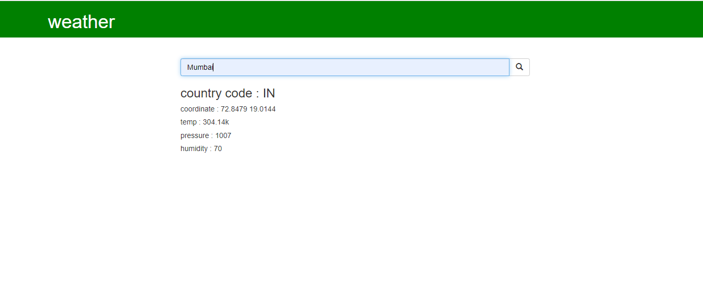

# weather app
<b> <h1> using  python framework</h1><b>

<b><h2>Home Page</h2></b> 

## Virtualenv & Dependencies
### create a virtualenv and run requirements.txt 

<b> what is virtual environment ? </b> 
A virtual environment is a tool that helps to keep dependencies required by different projects separate by creating isolated python virtual environments for them. This is one of the most important tools that most of the Python developers use.
 
<a href="https://www.geeksforgeeks.org/python-virtual-environment/" >read more... </a>

- <b>installing virtualenv</b>
<pre>$ pip install virtualenv</pre>

- <b>creating virtualenv</b>
<pre>$ virtualenv env</pre>
env is name of environment

- <b>activating virtual environment</b>
<pre>$ source env/bin/activate </pre>

- <b>run requirements.txt</b>
<pre>$ pip install -r requirements.txt</pre>

---

<strong>made by Akash Yadav  </strong>
